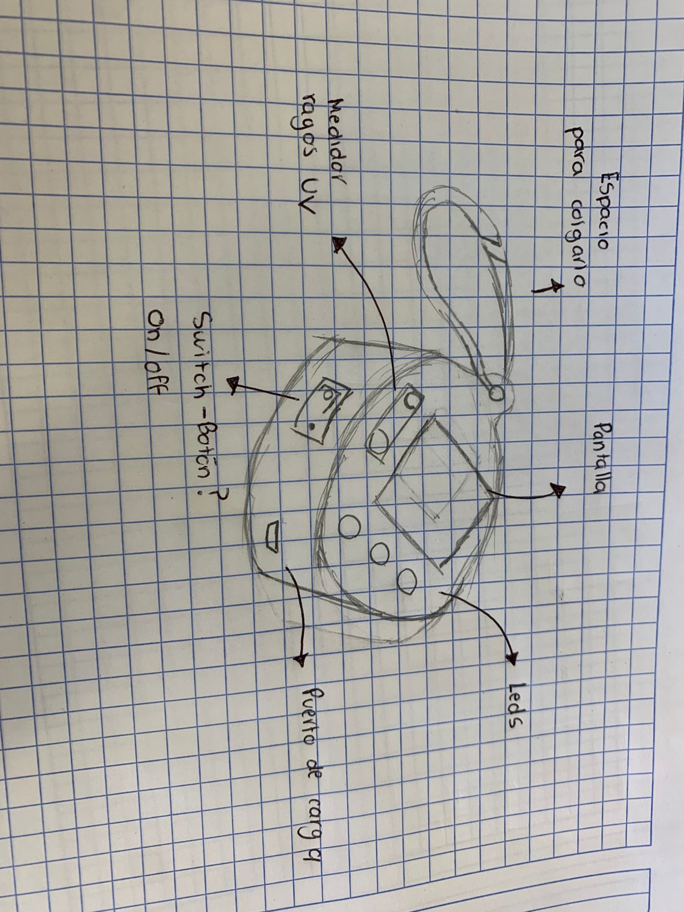

# Introduccion

Hola, mi nombre es Carlos Gutiérrez Martínez, tengo 19 años y soy estudiante en la Universidad Iberoamericana de Puebla, estudio la carrera de Ingeniería en Mecatrónica y estoy cursando mi quinto semestre.En este apartado estaré subiendo el progreso hecho durante mis clases de Proyectos de Ingeniería 4.

## Propuesta proyecto

La propuesta de mi proyecto a desarrollar este semestre consiste en un dispositivo capaz de medir la intensidad de los rayos UV del entorno en el que se encuentre y con base a eso poder realizar un diagnóstico de los cuidados necesarios para evitar daños en la piel, el producto está centrado principalmente en evitar daños o enfermedades potenciales a aquellas personas que cuentan con un tipo de piel sensible, al mismo tiempo busca poder funcionar como un producto que permita mantener un mejor cuidad de piel.

## Boceto inicial

## Caracteristicas que debe de tener el producto 

- Debe de ser capaz de transformar la intensidad de los rayos UV en valores numéricos.
- Tiene que ser capaz de generar una predicción en relación al tiempo que tardaría la piel en recibir daños.
- Tiene que tener los datos de los tipos de piel y como la variable de los rayos UV afecta de forma distinta a cada tipo de piel.

