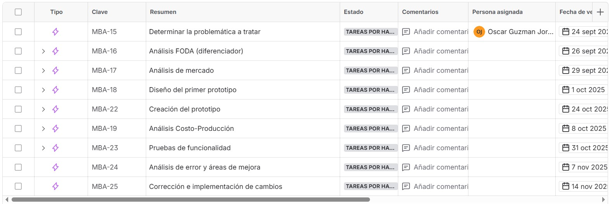
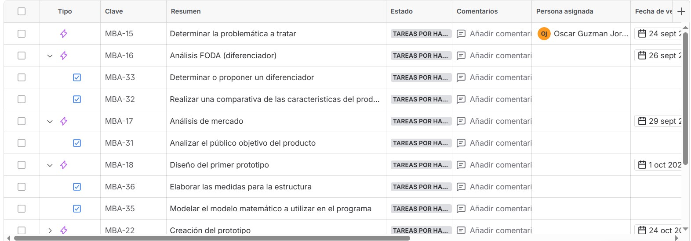
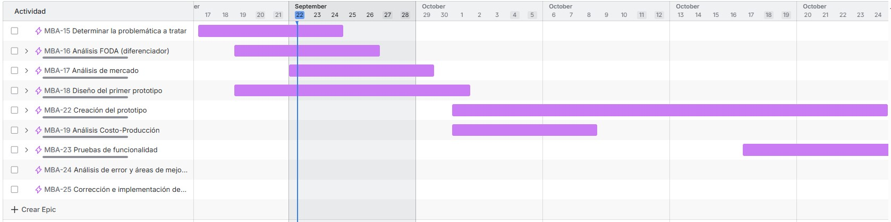

# Semana 3

Esta semana elabromas un diagrama de gantt para poder visualizar de manera organizada las tareas que debemos realizar para poder concretar el proyecto, y designar un periodo específico de tiempo a cada tarea, todo con el propósito de agilizar la elaboración del producto final.

## ¿Qué es un diagrama de Gantt?

Un diagrama de Gantt es en resumidas cuentas un gráfico de barras horizontales que muestran la duración, las fechas de inicio y fin, el progreso y las dependencias entre las tareas; ayuda mucho a la hora de agilizar y organizar proyectos de forma clara.

## Diagrama de Gantt del proyecto

Para el diagrama de Gantt nuestro equipo utilizó una plataforma llamada JIRA, la cual está especializada en diagramas para proyectos, la plataforma es sumamente sencilla de usar y permite asignar fechas, delegar tareas o actividades a diferentes miembros de equipo, y asignar un nivel de prioridad a cada tarea.

- **Paso 1:** Añadimos las tareas u objetivos principales, aquellos que son esenciales que cumplamos para poder terminar un producto exitoso.

- **Paso 2:** Colocamos sub-objetivos que permitan monitorear de forma más específica los avances requeridos, de esta forma se puede dividir el trabajo de forma más eficiente.

- **Paso 3:** Teniendo todo lo anterior solo nos movemos a la barra de nombre "cronograma" y podemos visualizar nuestro diagrama de Gantt ya finalizado, el cual ayudará a poder organizar nuestras tareas de forma limpia.

[Enlace para visualizar el diagrama de Gantt](https://iberopuebla.atlassian.net/jira/software/projects/MBA/boards/1/timeline?timeline=WEEKS&atlOrigin=eyJpIjoiZDIwOWExYzFjYTBmNDVhOGE1ZjJhNGY3ZWFkYjBkMWUiLCJwIjoiaiJ9)

