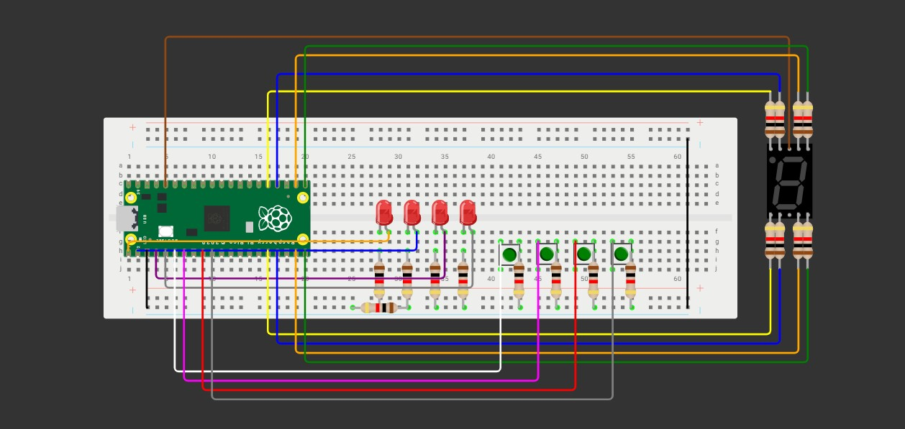

# Primer examen parcial

## Objetivo

Construir un juego Simón Dice de 4 colores en Raspberry Pi Pico 2.

- La secuencia crece +1 por ronda, de 1 hasta 15.
- La persona jugadora debe repetir la secuencia con 4 botones dentro de un tiempo límite por ronda.
- Tiempo límite por ronda (fase de entrada): TL = longitud + 5 segundos (p. ej., Ronda 7 → 12 s).
- Puntaje (0–15): mostrar la máxima ronda alcanzada en un display de 7 segmentos en hex (0–9, A, b, C, d, E, F).
- Aleatoriedad obligatoria: la secuencia debe ser impredecible en cada ejecución.

## Condiciones

1. **Encendido/Reset:** el 7 segmentos muestra “0” y queda en espera de Start (cualquier botón permite iniciar).
2. **Reproducción::** mostrar la secuencia actual (LEDs uno por uno con separación clara).
3. **Entrada:** al terminar la reproducción, la persona debe repetir la secuencia completa dentro de TL.
4. **Fallo (Game Over):** botón incorrecto, falta/extra de entradas o exceder TL.
5. **Progresión:** si acierta, puntaje = número de ronda, agrega 1 color aleatorio y avanza.
6. **Fin:** al fallar o completar la Ronda 15. Mostrar puntaje final en 7 segmentos (hex).


<iframe width="560" height="315" src="https://www.youtube.com/embed/qxONCEGjy-s?si=udAaNHlWfEXA1qbx" title="YouTube video player" frameborder="0" allow="accelerometer; autoplay; clipboard-write; encrypted-media; gyroscope; picture-in-picture; web-share" referrerpolicy="strict-origin-when-cross-origin" allowfullscreen></iframe>


``` bash

#include "pico/stdlib.h" // Librería básica de Raspberry Pi Pico (GPIO, sleep, etc.)
#include <stdlib.h>      // Para rand() y srand()
#include <time.h>        // Para obtener tiempo y usarlo como semilla aleatoria

// --- Pines de LEDs y botones ---
const uint LED_PINS[4] = {0, 1, 2, 3};       // Pines GPIO donde están conectados los LEDs
const uint BUTTON_PINS[4] = {4, 5, 6, 7};    // Pines GPIO donde están conectados los botones

// --- Pines de display de 7 segmentos (ánodo común) ---
const uint SEG_PINS[7] = {13, 12, 18, 17, 16, 14, 15}; // Pines de segmentos a-g

// --- Constantes de juego ---
#define MAX_ROUNDS 15      // Número máximo de rondas
#define LED_ON_TIME 400    // Tiempo en ms que un LED permanece encendido
#define LED_OFF_TIME 200   // Tiempo en ms que un LED permanece apagado entre flashes

int sequence[MAX_ROUNDS];  // Array donde se guarda la secuencia de LEDs de cada ronda

// --- Segmentos por nombre para mayor claridad ---
#define SEG_A 0
#define SEG_B 1
#define SEG_C 2
#define SEG_D 3
#define SEG_E 4
#define SEG_F 5
#define SEG_G 6

// --- Definición de números según qué segmentos se encienden (0-F) ---
const uint8_t NUM_SEGMENTS[16][7] = {
    {SEG_A, SEG_B, SEG_C, SEG_D, SEG_E, SEG_F, 255},   // 0
    {SEG_B, SEG_C, 255, 255, 255, 255, 255},           // 1
    {SEG_A, SEG_B, SEG_D, SEG_E, SEG_G, 255, 255},     // 2
    {SEG_A, SEG_B, SEG_C, SEG_D, SEG_G, 255, 255},     // 3
    {SEG_B, SEG_C, SEG_F, SEG_G, 255, 255, 255},       // 4
    {SEG_A, SEG_C, SEG_D, SEG_F, SEG_G, 255, 255},     // 5
    {SEG_A, SEG_C, SEG_D, SEG_E, SEG_F, SEG_G, 255},   // 6
    {SEG_A, SEG_B, SEG_C, 255, 255, 255, 255},         // 7
    {SEG_A, SEG_B, SEG_C, SEG_D, SEG_E, SEG_F, SEG_G}, // 8
    {SEG_A, SEG_B, SEG_C, SEG_D, SEG_F, SEG_G, 255},   // 9
    {SEG_A, SEG_B, SEG_C, SEG_E, SEG_F, SEG_G, 255},   // A
    {SEG_C, SEG_D, SEG_E, SEG_F, SEG_G, 255, 255},     // B
    {SEG_A, SEG_D, SEG_E, SEG_F, 255, 255, 255},       // C
    {SEG_B, SEG_C, SEG_D, SEG_E, SEG_G, 255, 255},     // D
    {SEG_A, SEG_D, SEG_E, SEG_F, SEG_G, 255, 255},     // E
    {SEG_A, SEG_E, SEG_F, SEG_G, 255, 255, 255}        // F
};

// --- Inicialización de hardware ---
void init_hardware() {
    // Configura LEDs y botones
    for (int i = 0; i < 4; i++) {
        gpio_init(LED_PINS[i]);           // Inicializa pin LED
        gpio_set_dir(LED_PINS[i], true);  // Lo pone como salida
        gpio_put(LED_PINS[i], 0);         // Lo apaga inicialmente

        gpio_init(BUTTON_PINS[i]);        // Inicializa pin de botón
        gpio_set_dir(BUTTON_PINS[i], false); // Lo pone como entrada
        gpio_pull_up(BUTTON_PINS[i]);     // Activa pull-up interno para leer 1 cuando no se presiona
    }

    // Configura display de 7 segmentos
    for (int i = 0; i < 7; i++) {
        gpio_init(SEG_PINS[i]);           // Inicializa pin de segmento
        gpio_set_dir(SEG_PINS[i], true);  // Salida
        gpio_put(SEG_PINS[i], 1);         // Apaga todos los segmentos inicialmente (ánodo común)
    }
}

// --- Enciende un LED por un tiempo y lo apaga ---
void blink_led(int led_index) {
    gpio_put(LED_PINS[led_index], 1);   // Enciende LED
    sleep_ms(LED_ON_TIME);               // Espera tiempo definido
    gpio_put(LED_PINS[led_index], 0);   // Apaga LED
    sleep_ms(LED_OFF_TIME);              // Espera tiempo definido antes del siguiente LED
}

// --- Muestra un número en el display de 7 segmentos ---
void display_number_inverted(uint8_t num) {
    if (num > 15) return;                // Solo números 0-F
    for (int i = 0; i < 7; i++) gpio_put(SEG_PINS[i], 1); // Apaga todos los segmentos
    for (int j = 0; j < 7; j++) {
        if (NUM_SEGMENTS[num][j] == 255) break;           // Fin de segmentos para ese número
        gpio_put(SEG_PINS[NUM_SEGMENTS[num][j]], 0);     // Enciende segmento correspondiente
    }
}

// --- Espera a que se presione cualquier botón ---
void wait_any_button() {
    while (true) {
        for (int i = 0; i < 4; i++) {
            if (!gpio_get(BUTTON_PINS[i])) { // Si se presiona
                sleep_ms(50);               // Debounce inicial
                while (!gpio_get(BUTTON_PINS[i])); // Espera a soltar
                sleep_ms(50);               // Debounce final
                return;                     // Sale de la función
            }
        }
    }
}

// --- Lee qué botón se presiona con timeout ---
int read_button_timeout(int timeout_seconds) {
    absolute_time_t end_time = make_timeout_time_ms(timeout_seconds * 1000); // Calcula momento final
    while (absolute_time_diff_us(get_absolute_time(), end_time) > 0) {      // Mientras no se acabe el tiempo
        for (int i = 0; i < 4; i++) {
            if (!gpio_get(BUTTON_PINS[i])) { // Si se presiona botón
                sleep_ms(50);                // Debounce
                while (!gpio_get(BUTTON_PINS[i])); // Espera a soltar
                sleep_ms(50);                // Debounce final
                return i;                    // Devuelve índice del botón presionado
            }
        }
    }
    return -1; // Timeout, no se presionó ningún botón
}

// --- Parpadea la ronda actual en el display ---
void flash_round(uint8_t round_num, int times, int ms_delay) {
    for (int i = 0; i < times; i++) {
        display_number_inverted(round_num);        // Muestra número
        sleep_ms(ms_delay);                        // Espera
        for (int k = 0; k < 7; k++) gpio_put(SEG_PINS[k], 1); // Apaga todos los segmentos
        sleep_ms(ms_delay);                        // Espera antes del siguiente parpadeo
    }
}

// --- Parpadea LEDs y muestra número si el jugador falla ---
void flash_error(int failed_round) {
    display_number_inverted(failed_round);         // Muestra ronda donde falló
    for (int i = 0; i < 3; i++) {                 // Parpadea 3 veces
        for (int j = 0; j < 4; j++) gpio_put(LED_PINS[j], 1); // Enciende todos los LEDs
        sleep_ms(300);                             // Espera 300 ms
        for (int j = 0; j < 4; j++) gpio_put(LED_PINS[j], 0); // Apaga todos los LEDs
        sleep_ms(300);                             // Espera 300 ms
    }
}

// --- Función principal ---
int main() {
    stdio_init_all();    // Inicializa la comunicación serial (opcional)
    init_hardware();     // Inicializa LEDs, botones y display

    while (true) {       // Bucle infinito del juego
        wait_any_button();                        // Espera a que el jugador presione un botón para iniciar
        srand(to_us_since_boot(get_absolute_time())); // Inicializa semilla aleatoria con tiempo

        int round = 0;                            // Empieza en ronda 0
        bool game_over = false;

        while (!game_over && round < MAX_ROUNDS) { // Mientras no haya terminado el juego
            sequence[round] = rand() % 4;         // Genera LED aleatorio para la ronda

            display_number_inverted(round + 1);   // Muestra número de ronda

            for (int i = 0; i <= round; i++) blink_led(sequence[i]); // Reproduce secuencia de LEDs

            for (int i = 0; i <= round; i++) {   // Jugador intenta repetir la secuencia
                int btn = read_button_timeout(5 + round); // Tiempo de respuesta aumenta con la ronda
                if (btn == -1 || btn != sequence[i]) {    // Si falla o timeout
                    game_over = true;
                    flash_error(round + 1);              // Feedback visual de error
                    break;
                }
                blink_led(btn);                           // Feedback visual si presiona correcto
            }

            if (!game_over) {                              // Si acierta, pasa a la siguiente ronda
                round++;
                if (round < MAX_ROUNDS) flash_round(round + 1, 2, 300); // Parpadea número de la siguiente ronda
            }
        }
    }

    return 0;
}

```

