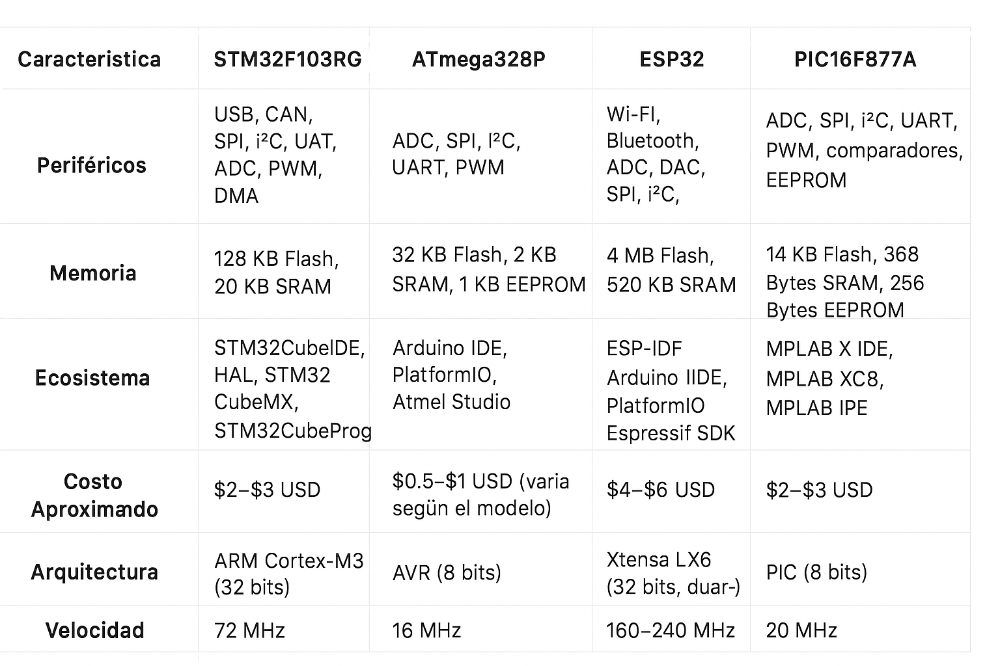

# Tarea 1 

 El objetivo de este trabajo consiste en investigar al menos 4 microcontroladores de distintas marcas que puedan ser utilizados para la fabricación de una lampara para dormir y hacer una tabla comparativa de:

- **Perifericos**  
- **Memoria** 
- **Ecosistema** 
- **Costos** 
- **Arquitectura** 
- **Velocidad de trabajo** 

---

## Proyecto
Lampara para dormir que cambia el color y potencia de la luz para ayudar a inducir el sueño.

## Tabla comparativa

---

## Ranking (mejor a peor)
1. **ATmega328P** :Es fácil de programar en Arduino IDE, barato, y debido a su gran comunidad ya hay ejemplos y guías fáciles que se pueden utilizar como referencia.
2. **PIC16F877A** :Cuenta con una memoria EEPROM (memoria de solo lectura programable y borrable eléctricamente), que permite guardar datos incluso al estar apagada, ecosistema menos amigable, requiere MPLAB X IDE y compilador XC8, no es tan fácil de programar con en Arduino.
3. **STM32F103RG** :Este micro es muy poderoso (32 bits, 72 MHz) y con muchos periféricos, es muy rápido, con mucha memoria y muy profesional, pero por lo mismo es más complejo de programar, requiere más energía y es más costoso.
4. **ESP32** :Aunque es súper potente (Wi-Fi, Bluetooth, doble núcleo a 240 MHz), todas esas características sobran para una lámpara.Su precio es el más alto, y es relativamente más complejo de configurar en comparación con los demás

---

