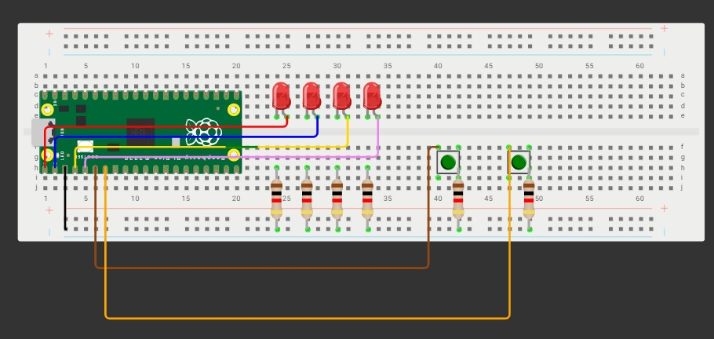

# Tarea 3

## Objetivo

Crear los siguientes códigos usando lógica y máscaras (no se vale enumerar todas las combinaciones con if):

**Compuertas básicas AND / OR / XOR con 2 botones**

Qué debe hacer: Con dos botones A y B (pull-up; presionado=0) enciende tres LEDs que muestren en paralelo los resultados de AND, OR y XOR. En el video muestra las 4 combinaciones (00, 01, 10, 11).

**Selector cíclico de 4 LEDs con avance/retroceso**

Qué debe hacer: Mantén un único LED encendido entre LED0..LED3. Un botón AVANZA (0→1→2→3→0) y otro RETROCEDE (0→3→2→1→0). Un push = un paso (antirrebote por flanco: si dejas presionado no repite). En el video demuestra en ambos sentidos.

## Compuertas AND/OR/XOR

<iframe width="560" height="315"
  src="https://www.youtube.com/embed/SRo8bzYf3PM?si=kMqovu7biOuajElD"
  title="YouTube video player"
  frameborder="0"
  allow="accelerometer; autoplay; clipboard-write; encrypted-media; gyroscope; picture-in-picture"
  allowfullscreen>
</iframe>

```bash

#include "pico/stdlib.h"   


#define BTN_A 4
#define BTN_B 5
#define LED_AND 0
#define LED_OR  1
#define LED_XOR 2

int main() {
    stdio_init_all();  

    // Configurar botones como entrada con resistencia pull-up
    gpio_init(BTN_A);
    gpio_set_dir(BTN_A, false);   // false = input
    gpio_pull_up(BTN_A);          // activa resistencia pull-up

    gpio_init(BTN_B);
    gpio_set_dir(BTN_B, false);   
    gpio_pull_up(BTN_B);

    // Configurar LEDs como salida
    gpio_init(LED_AND);
    gpio_set_dir(LED_AND, true);  // true = output

    gpio_init(LED_OR);
    gpio_set_dir(LED_OR, true);

    gpio_init(LED_XOR);
    gpio_set_dir(LED_XOR, true);

    
    while (true) {
        
        uint A = !gpio_get(BTN_A);  // lee botón A 
        uint B = !gpio_get(BTN_B);  // lee botón B

        // lógica con máscaras
        uint res_and = A & B;   
        uint res_or  = A | B;   
        uint res_xor = A ^ B;   

        // mandamos el resultado a los LEDs
        gpio_put(LED_AND, res_and);
        gpio_put(LED_OR,  res_or);
        gpio_put(LED_XOR, res_xor);

        sleep_ms(50); 
    }
}
```
<iframe width="560" height="315"
  src="https://www.youtube.com/embed/ohbZTIRZ47c?si=AU9lRl6HRSmG_YTE"
  title="YouTube video player"
  frameborder="0"
  allow="accelerometer; autoplay; clipboard-write; encrypted-media; gyroscope; picture-in-picture"
  allowfullscreen>
</iframe>

```bash
#include "pico/stdlib.h"
#include "hardware/gpio.h"

const uint LED_PINS[] = {0, 1, 2, 3};
const int NUM_LEDS = sizeof(LED_PINS) / sizeof(LED_PINS[0]);

const uint LEFT_BUTTON_PIN = 4;
const uint RIGHT_BUTTON_PIN = 5;

const int DEBOUNCE_DELAY_MS = 100;

void setup_gpio();
void update_leds(int current_led_index);

int main() {
    stdio_init_all();
    setup_gpio();

    int current_led = 0;
    update_leds(current_led);

    while (true) {
        if (!gpio_get(RIGHT_BUTTON_PIN)) {
            sleep_ms(DEBOUNCE_DELAY_MS);
            if (!gpio_get(RIGHT_BUTTON_PIN)) {
                current_led++;
                if (current_led >= NUM_LEDS) {
                    current_led = 0;
                }
                update_leds(current_led);
                while (!gpio_get(RIGHT_BUTTON_PIN));
            }
        }

        if (!gpio_get(LEFT_BUTTON_PIN)) {
            sleep_ms(DEBOUNCE_DELAY_MS);
            if (!gpio_get(LEFT_BUTTON_PIN)) {
                current_led--;
                if (current_led < 0) {
                    current_led = NUM_LEDS - 1;
                }
                update_leds(current_led);
                while (!gpio_get(LEFT_BUTTON_PIN));
            }
        }
    }
    return 0;
}

void setup_gpio() {
    for (int i = 0; i < NUM_LEDS; i++) {
        gpio_init(LED_PINS[i]);
        gpio_set_dir(LED_PINS[i], GPIO_OUT);
    }

    gpio_init(LEFT_BUTTON_PIN);
    gpio_set_dir(LEFT_BUTTON_PIN, GPIO_IN);
    gpio_pull_up(LEFT_BUTTON_PIN);

    gpio_init(RIGHT_BUTTON_PIN);
    gpio_set_dir(RIGHT_BUTTON_PIN, GPIO_IN);
    gpio_pull_up(RIGHT_BUTTON_PIN);
}

void update_leds(int current_led_index) {
    for (int i = 0; i < NUM_LEDS; i++) {
        if (i == current_led_index) {
            gpio_put(LED_PINS[i], 1);
        } else {
            gpio_put(LED_PINS[i], 0);
        }
    }
}
```

## Diagrama de conexión





