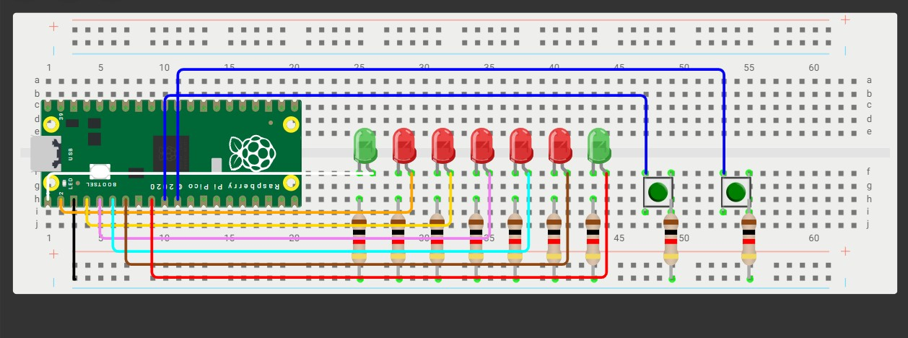

# Tarea 4

## Objetivo 

Programar un mini-Pong con 5 LEDs en línea y 2 botones usando interrupciones (ISR) para registrar el “golpe” del jugador exactamente cuando la “pelota” (un LED encendido) llega al extremo de su lado.

## Reglas del código

1. **Pelota**: es un único LED encendido que se mueve automáticamente de un extremo al otro (L1→L5→L1…) a un ritmo fijo.
2. **Golpe con ISR**:cada botón genera una interrupción.

El BTN_L solo cuenta si, en el instante de la ISR, la pelota está en L1.

El BTN_R solo cuenta si, en el instante de la ISR, la pelota está en L5.

Si coincide, la pelota rebota: invierte su dirección.

Si no coincide (la pelota no está en el último LED de ese lado), el botón se ignora.

3. **Fallo y punto**:si la pelota alcanza L1 y no hubo golpe válido del lado izquierdo en ese momento, anota el jugador derecho. Análogamente, si alcanza L5 sin golpe válido, anota el jugador izquierdo.

4. **Indicador de punto**:al anotar, se parpadea el LED de punto 3 veces del jugador que metió el punto .

5. **Reinicio tras punto**:después del parpadeo, la pelota se reinicia en el centro (L3) y comienza a moverse hacia el jugador que metió el punto.

6. **Inicio del juego**:al encender, la pelota inicia en L3 y no se mueve hasta que se presione un boton y debera moverse a la direccion opuesta del boton presionado.


<iframe width="560" height="315"
  src="https://www.youtube.com/embed/Ml6RB5mvFMo?si=jjIu5VQq2560vfzT"
  title="YouTube video player"
  frameborder="0"
  allow="accelerometer; autoplay; clipboard-write; encrypted-media; gyroscope; picture-in-picture"
  allowfullscreen>
</iframe>

## Código PONG ##

```bash


//Pong version final

#include "pico/stdlib.h"
#include "hardware/gpio.h"
#include "hardware/watchdog.h"

#define NUM_LEDS 5
#define DELAY_MS 400
const uint BTN1 = 5; // botón izquierdo
const uint BTN2 = 6; // botón derecho
const uint LED_PINS[NUM_LEDS] = {0, 1, 2, 3, 4};
const uint LEDG1 = 8; // LED indicador derecha
const uint LEDG2 = 7; // LED indicador izquierda

volatile bool REBOTE1 = false;
volatile bool REBOTE2 = false;

void button_isr(uint gpio, uint32_t events)
{
    if (gpio == BTN1)
        REBOTE1 = true;
    else if (gpio == BTN2)
        REBOTE2 = true;
}

// --- Función para indicar un punto ---
void score_point(uint led)
{
    for (int i = 0; i < 3; i++)
    {
        gpio_put(led, 1);
        sleep_ms(150);
        gpio_put(led, 0);
        sleep_ms(150);
    }
}

int main()
{
    // Inicializar LEDs de victoria
    gpio_init(LEDG1);
    gpio_set_dir(LEDG1, true);
    gpio_put(LEDG1, 0);
    gpio_init(LEDG2);
    gpio_set_dir(LEDG2, true);
    gpio_put(LEDG2, 0);

    // Inicializar botones
    gpio_init(BTN1);
    gpio_set_dir(BTN1, false);
    gpio_pull_up(BTN1);
    gpio_set_irq_enabled_with_callback(BTN1, GPIO_IRQ_EDGE_FALL, true, &button_isr);

    gpio_init(BTN2);
    gpio_set_dir(BTN2, false);
    gpio_pull_up(BTN2);
    gpio_set_irq_enabled(BTN2, GPIO_IRQ_EDGE_FALL, true);

    // Inicializar LEDs del juego
    for (int i = 0; i < NUM_LEDS; i++)
    {
        gpio_init(LED_PINS[i]);
        gpio_set_dir(LED_PINS[i], true);
    }

    int current_led = NUM_LEDS / 2;
    int direction = 0; // 0 = stopped, 1 = right, -1 = left
    bool game_started = false;

    // Show ball at center before game starts
    gpio_put(LED_PINS[current_led], 1);

    while (true)
    {
        if (!game_started)
        {
            if (REBOTE1)
            {
                direction = 1; // Move right
                game_started = true;
                REBOTE1 = false;
                gpio_put(LED_PINS[current_led], 0); // Turn off center LED
            }
            else if (REBOTE2)
            {
                direction = -1; // Move left
                game_started = true;
                REBOTE2 = false;
                gpio_put(LED_PINS[current_led], 0); // Turn off center LED
            }
            else
            {
                // Wait for button press to start
                tight_loop_contents();
                continue;
            }
        }

        gpio_put(LED_PINS[current_led], 1);
        sleep_ms(DELAY_MS);
        gpio_put(LED_PINS[current_led], 0);

        current_led += direction;

        // PELOTA IZQUIERDA
        if (current_led == -1)
        {
            if (REBOTE1)
            {
                direction = 1;
                current_led = 0;
                REBOTE1 = false;
            }
            else
            {
                // Player 2 (right) scores
                score_point(LEDG1);
                current_led = NUM_LEDS / 2; // Reset to center
                direction = 1;              // Move towards winner (right)
            }
        }

        // PELOTA DERECHA
        if (current_led == NUM_LEDS)
        {
            if (REBOTE2)
            {
                direction = -1;
                current_led = NUM_LEDS - 1;
                REBOTE2 = false;
            }
            else
            {
                // Player 1 (left) scores
                score_point(LEDG2);
                current_led = NUM_LEDS / 2; // Reset to center
                direction = -1;             // Move towards winner (left)
            }
        }
    }
}

```


## Diagrama de conexión




## ¿Se están respetando los límites de corriente de los pines de la Pico 2?

¿Acaso te hiciste esa pregunta al ver este trabajo?, pues yo tampoco pero gracias a Dios no quemamos ninguno de los pines, entonces hagamos el cálculo de porque no cometimos la tontería de quemarlos:

Tenemos los siguientes componentes conectados a la Pico 2:

- **7 Leds**:todos con resistencias de 1K conectadas a GND.
- **2 Push button**:tenemos 2 Push buttons conectados igual a resistencias de 1K conectadas a GND.

Para el cálculo usamos la Ley de Ohm, que funciona de forma que la corriente es igual a (Voltaje del pin-Voltaje del Led)/Resistencia, los pines tienen un voltaje de salida de 3.3V y los leds estándar consumen 2V, por lo que:

(3.3V-2V/1 Kilo Ohm)=1.3 mA

Los botones con resistencia de 1 kΩ en serie limitan la corriente cuando se presionan, por lo que los calculos nos darían (Voltaje de pin/resistencia), lo que nos da:

(3.3V/1 Kilo Ohm)=3.3 mA

Los GPIO de la Pico 2 soportan hasta 12 mA recomendados por pin, con máximo absoluto de 16 mA, y la corriente total del chip recomienda 50 mA en todos los pines juntos, por lo que se pude notar que se está dentro del límite permitido.