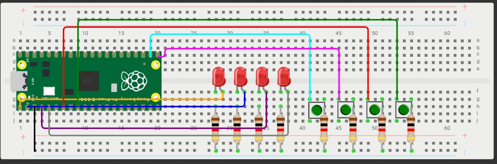

# Tarea 6

## Objetivo

## Ejercicio 1

- Programa cuatro alarmas / cuatro LEDs a distintas frecuencias.

- Configurar ALARM0..ALARM3 del timer de sistema en modo µs. Cada alarma controla un LED distinto con un periodo propio. 

<iframe width="560" height="315" src="https://www.youtube.com/embed/8FS1Yjh5ScY?si=vhnhhteXavxvHwQ7" title="YouTube video player" frameborder="0" allow="accelerometer; autoplay; clipboard-write; encrypted-media; gyroscope; picture-in-picture; web-share" referrerpolicy="strict-origin-when-cross-origin" allowfullscreen></iframe>


```bash
#include "pico/stdlib.h"
#include "hardware/gpio.h"
#include "hardware/irq.h"
#include "hardware/structs/timer.h"

// Definimos los pins
const uint LED_PINS[] = {0, 1, 2, 3};
const uint32_t PERIODS_US[] = {200000, 500000, 1000000, 2000000};
#define NUM_LEDS 4

// Programaicón de la ISR universal para las 4 alarmas
void timer_isr() {
    uint64_t now = timer_hw->timerawl; //tiempo actual del sistema en microsegundos

    for (int i = 0; i < NUM_LEDS; i++) {
        if (timer_hw->intr & (1u << i)) {   // Verificar interrupción de alarma i
            gpio_xor_mask(1u << LED_PINS[i]); // Con la mascara de XOR cambiamos el esta
            timer_hw->alarm[i] = now + PERIODS_US[i]; // Reprogramar alarma, Se suma PERIODS_US[i] para que la próxima interrupción ocurra despues de ese tiempo
            timer_hw->intr = (1u << i);  // Con el 1 limpiamos la flag, con 0 no se hace nada
        }
    }
}

int main() {
    stdio_init_all();

    //Configuraciones de los pines de los leds


    for (int i = 0; i < NUM_LEDS; i++) {
        gpio_init(LED_PINS[i]);
        gpio_set_dir(LED_PINS[i], true);
    }

    //Configuración de las interrupciones del timer
    irq_set_exclusive_handler(TIMER0_IRQ_0, timer_isr);  
    irq_set_enabled(TIMER0_IRQ_0, true);

    // Alarmas
    uint64_t now = timer_hw->timerawl;
    for (int i = 0; i < NUM_LEDS; i++) {
        timer_hw->alarm[i] = now + PERIODS_US[i];//Con esto arranca las alarmas desde el momento en el que se inicializa
    }

    //Con esto habilitamos la función de interrumpir, si no lo hacemos, las interrupciones 
    //no funcionan, por lo que activamos los 4 bits
    timer_hw->inte = (1u << 0) | (1u << 1) | (1u << 2) | (1u << 3);

    //loop de repetición (1) significa que se mantenga repitiéndose
    while (1) {
    }
}
```


## Ejercicio 2

Modificar el pong, para tener dos botones adicionales, que suban y bajen la velocidad del juego sin delay.


<iframe width="560" height="315" src="https://www.youtube.com/embed/H7XshDR7keg?si=2gsDRRv3MXH4dSQk" title="YouTube video player" frameborder="0" allow="accelerometer; autoplay; clipboard-write; encrypted-media; gyroscope; picture-in-picture; web-share" referrerpolicy="strict-origin-when-cross-origin" allowfullscreen></iframe>


```bash
#include "pico/stdlib.h"
#include "hardware/gpio.h"

#define NUM_LEDS 5
#define DELAY_MIN 100
#define DELAY_MAX 1000
#define DELAY_STEP 100

const uint BTN1 = 5;     // botón izquierdo
const uint BTN2 = 6;     // botón derecho
const uint BTN_UP = 16;   // subir velocidad
const uint BTN_DOWN = 17;// bajar velocidad
const uint LED_PINS[NUM_LEDS] = {0, 1, 2, 3, 4};
const uint LEDG1 = 8;    // LED indicador derecha
const uint LEDG2 = 7;    // LED indicador izquierda

volatile bool REBOTE1 = false;
volatile bool REBOTE2 = false;
volatile bool SPEED_UP = false;
volatile bool SPEED_DOWN = false;

void button_isr(uint gpio, uint32_t events) {
    if (gpio == BTN1) REBOTE1 = true;
    else if (gpio == BTN2) REBOTE2 = true;
    else if (gpio == BTN_UP) SPEED_UP = true;
    else if (gpio == BTN_DOWN) SPEED_DOWN = true;
}

void score_point(uint led) {
    for (int i = 0; i < 3; i++) {
        gpio_put(led, 1);
        sleep_ms(150);
        gpio_put(led, 0);
        sleep_ms(150);
    }
}

int main() {
    // LEDs de victoria
    gpio_init(LEDG1); gpio_set_dir(LEDG1, true);
    gpio_init(LEDG2); gpio_set_dir(LEDG2, true);

    // Botones
    gpio_init(BTN1); gpio_set_dir(BTN1, false); gpio_pull_up(BTN1);
    gpio_set_irq_enabled_with_callback(BTN1, GPIO_IRQ_EDGE_FALL, true, &button_isr);

    gpio_init(BTN2); gpio_set_dir(BTN2, false); gpio_pull_up(BTN2);
    gpio_set_irq_enabled(BTN2, GPIO_IRQ_EDGE_FALL, true);

    gpio_init(BTN_UP); gpio_set_dir(BTN_UP, false); gpio_pull_up(BTN_UP);
    gpio_set_irq_enabled(BTN_UP, GPIO_IRQ_EDGE_FALL, true);

    gpio_init(BTN_DOWN); gpio_set_dir(BTN_DOWN, false); gpio_pull_up(BTN_DOWN);
    gpio_set_irq_enabled(BTN_DOWN, GPIO_IRQ_EDGE_FALL, true);

    // LEDs del juego
    for (int i = 0; i < NUM_LEDS; i++) {
        gpio_init(LED_PINS[i]);
        gpio_set_dir(LED_PINS[i], true);
    }

    int current_led = NUM_LEDS / 2;
    int direction = 0;
    bool game_started = false;
    int delay_ms = 400; // velocidad inicial

    gpio_put(LED_PINS[current_led], 1);

    while (true) {
        // Ajustar velocidad (nota: se evalúa **una vez por ciclo**)
        if (SPEED_UP) {
            if (delay_ms > DELAY_MIN) delay_ms -= DELAY_STEP;
            SPEED_UP = false;
        }
        if (SPEED_DOWN) {
            if (delay_ms < DELAY_MAX) delay_ms += DELAY_STEP;
            SPEED_DOWN = false;
        }

        // Inicio del juego
        if (!game_started) {
            if (REBOTE1) { direction = 1; game_started = true; REBOTE1 = false; gpio_put(LED_PINS[current_led], 0);}
            else if (REBOTE2) { direction = -1; game_started = true; REBOTE2 = false; gpio_put(LED_PINS[current_led], 0);}
            else continue;
        }

        gpio_put(LED_PINS[current_led], 1);
        sleep_ms(delay_ms);  // <<<<<< el delay depende del botón
        gpio_put(LED_PINS[current_led], 0);

        current_led += direction;

        if (current_led == -1) {
            if (REBOTE1) { direction = 1; current_led = 0; REBOTE1 = false; }
            else { score_point(LEDG1); current_led = NUM_LEDS/2; direction = 1; }
        }
        if (current_led == NUM_LEDS) {
            if (REBOTE2) { direction = -1; current_led = NUM_LEDS - 1; REBOTE2 = false; }
            else { score_point(LEDG2); current_led = NUM_LEDS/2; direction = -1; }
        }
    }
}
```

## Diagrama de conexión

