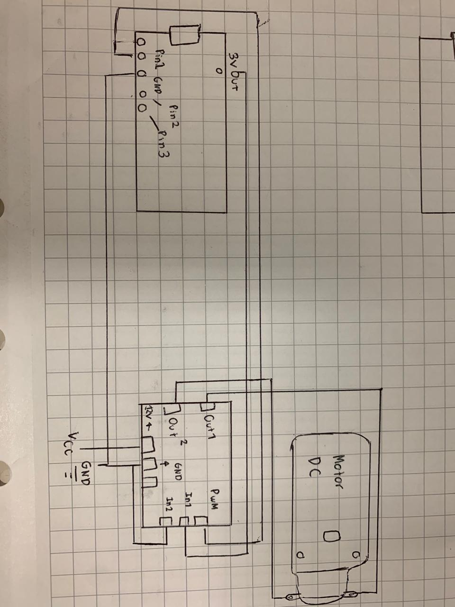
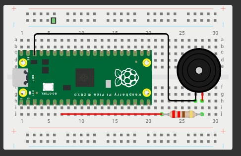
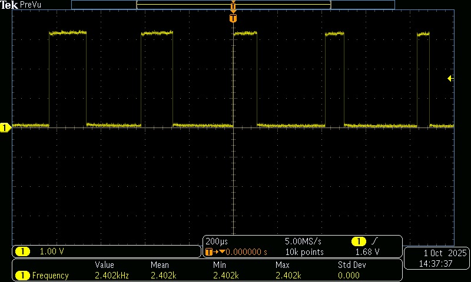
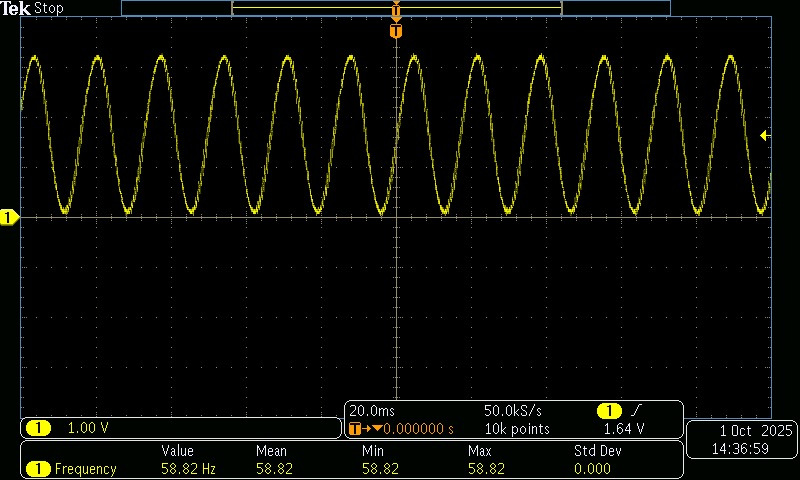
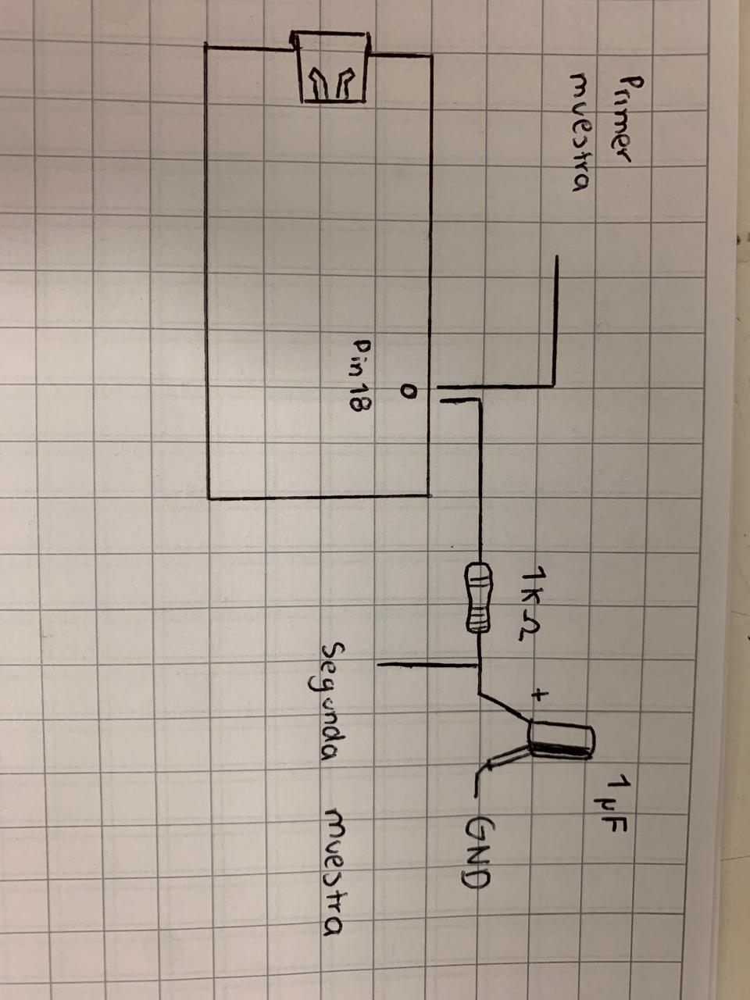

# Tarea 7

## Tarea 7.1

Implementar un circuito con un motor DC controlado mediante PWM variando el duty cycle.

Usar 2 botones para seleccionar entre 3 velocidades predefinidas (baja, media y alta).

Documentar:

- Valores de duty usados, con el porque.

- Circuito

- Codigo

<iframe width="560" height="315" src="https://www.youtube.com/embed/3LVTIqdxLq0?si=Y7fli-6X_AN7fAab" title="YouTube video player" frameborder="0" allow="accelerometer; autoplay; clipboard-write; encrypted-media; gyroscope; picture-in-picture; web-share" referrerpolicy="strict-origin-when-cross-origin" allowfullscreen></iframe>


```bash

#include "pico/stdlib.h"
#include "hardware/pwm.h"

#define LED_PIN 1
const uint BTN1 = 2; 
const uint BTN2 = 3; 
#define F_PWM_HZ 2000
#define TOP 1022

int main() {
    stdio_init_all();

    // Inicializar botones con pull-up
    gpio_init(BTN1); gpio_set_dir(BTN1, GPIO_IN); gpio_pull_up(BTN1);
    gpio_init(BTN2); gpio_set_dir(BTN2, GPIO_IN); gpio_pull_up(BTN2);

    // Configurar LED como PWM
    gpio_set_function(LED_PIN, GPIO_FUNC_PWM);
    uint slice = pwm_gpio_to_slice_num(LED_PIN);
    uint chan  = pwm_gpio_to_channel(LED_PIN);

    float f_clk = 125000000.0f;
    float div = f_clk / (F_PWM_HZ * (TOP + 1));
    pwm_set_clkdiv(slice, div);
    pwm_set_wrap(slice, TOP);
    pwm_set_chan_level(slice, chan, 0); // inicia apagado
    pwm_set_enabled(slice, true);

    int level = 622;  // nivel inicial

    // Con esto podemos hacer que solo se tenga que presionar el boton 1 vez
    bool btn1_presionado = false;
    bool btn2_presionado = false;

    while (true) {
        // Leer botones
        bool b1 = gpio_get(BTN1) == 0;
        bool b2 = gpio_get(BTN2) == 0;

        // El boton 1 disminuye el nivel 200
        if (b1 && !btn1_presionado) {
            level -= 200;
            if (level < 0) level = 0; // limite mínimo
            btn1_presionado = true;
        } else if (!b1) {
            btn1_presionado = false;
        }

        // BTN2 → aumentar nivel 200
        if (b2 && !btn2_presionado) {// Si el boton esta presionado y b2 es 1
            level += 200;
            if (level > TOP) level = TOP; // limite en el TOP
            btn2_presionado = true;
        } else if (!b2) {
            btn2_presionado = false;//Con esto mantenemos registro de si estan presionados o no, para usar como referencia
        }

        // Aplicar PWM
        pwm_set_chan_level(slice, chan, level);

       
    }
}
```



## Tarea 7.2

Programar un buzzer piezoeléctrico para reproducir una melodía reconocible.

Variar la frecuencia del PWM para las notas, manteniendo el duty en 50 %.

Cada nota debe incluir su frecuencia y duración en el código.

Documentar:

- Tabla con notas, frecuencias y duración usadas.

- Evidencia en audio o video de la melodía funcionando.

<iframe width="560" height="315" src="https://www.youtube.com/embed/BkZzIRTb1Hc?si=_qWQ125yZLIZpZxu" title="YouTube video player" frameborder="0" allow="accelerometer; autoplay; clipboard-write; encrypted-media; gyroscope; picture-in-picture; web-share" referrerpolicy="strict-origin-when-cross-origin" allowfullscreen></iframe>

```bash
#include "pico/stdlib.h"
#include "hardware/pwm.h"

#define BUZZER_PIN 5
#define TOP 2048

// Notas
#define FAs 740.0f
#define RE  587.0f  
#define SI  494.0f
#define MI  659.0f
#define SOLs 831.0f
#define LA  880.0f
#define DOs 988.0f

// Duraciones
#define CORCHEA 214
#define SILENCIO 214  // Los espacios son silencios de 214ms

void tocar_nota(uint slice, uint chan, float frecuencia, int duracion) {
    if (frecuencia > 1.0f) {
        float f_clk = 150000000.0f;
        float div = f_clk / (frecuencia * (TOP + 1));
        pwm_set_clkdiv(slice, div);
        pwm_set_chan_level(slice, chan, TOP / 2);
        sleep_ms(duracion);
        pwm_set_chan_level(slice, chan, 0);
    }
    sleep_ms(30); // Pequeña pausa entre notas
}

void tocar_silencio(int duracion) {
    sleep_ms(duracion);
}

void tocar_melodia(uint slice, uint chan) {
    

    // MI MI MI
    tocar_nota(slice, chan, MI, 300);
    tocar_nota(slice, chan, MI, 300);
    tocar_nota(slice, chan, MI, 600);

    tocar_silencio(150);

    // MI MI MI
    tocar_nota(slice, chan, MI, 300);
    tocar_nota(slice, chan, MI, 300);
    tocar_nota(slice, chan, MI, 600);

    tocar_silencio(150);

    // MI SOLs DOs RE MI
    tocar_nota(slice, chan, MI, 300);
    tocar_nota(slice, chan, SOLs, 300);
    tocar_nota(slice, chan, DOs, 300);
    tocar_nota(slice, chan, RE, 300);
    tocar_nota(slice, chan, MI, 600);

    tocar_silencio(300);

    // RE RE RE RE RE MI RE
    tocar_nota(slice, chan, RE, 300);
    tocar_nota(slice, chan, RE, 300);
    tocar_nota(slice, chan, RE, 300);
    tocar_nota(slice, chan, RE, 300);
    tocar_nota(slice, chan, RE, 300);
    tocar_nota(slice, chan, MI, 300);
    tocar_nota(slice, chan, RE, 600);

    tocar_silencio(300);

    // MI MI MI MI MI SOLs RE
    tocar_nota(slice, chan, MI, 300);
    tocar_nota(slice, chan, MI, 300);
    tocar_nota(slice, chan, MI, 300);
    tocar_nota(slice, chan, MI, 300);
    tocar_nota(slice, chan, MI, 300);
    tocar_nota(slice, chan, SOLs, 300);
    tocar_nota(slice, chan, RE, 600);

    tocar_silencio(600); // Pausa larga antes de repetir
}

int main() {
    stdio_init_all();

    gpio_set_function(BUZZER_PIN, GPIO_FUNC_PWM);
    uint slice = pwm_gpio_to_slice_num(BUZZER_PIN);
    uint chan  = pwm_gpio_to_channel(BUZZER_PIN);

    pwm_set_wrap(slice, TOP);
    pwm_set_chan_level(slice, chan, TOP / 2);
    pwm_set_enabled(slice, true);

    while (true) {
        tocar_melodia(slice, chan);
        sleep_ms(2000); // Pausa larga antes de repetir
    }
}

```




## Tarea 7.3

Generar una señal sinusoidal aproximada de 60 Hz variando el duty cycle del PWM según una función seno.

Construir un filtro RC pasabajos básico y verificar la señal en el osciloscopio:

Documentar:

- Capturas de osciloscopio Antes del filtro (PWM) y Después del filtro.

El filtro RC se diseña para dejar pasar señales de 60 Hz y eliminar las componentes de alta frecuencia que provienen del PWM.

La frecuencia de corte (fcf_cfc​) es el punto donde el filtro empieza a atenuar las señales. Matemáticamente:

En este caso, queremos que fc sea un poco mayor que 60 Hz para que nuestra señal sinusoidal de 60 Hz no sea atenuada.

## Señal pre filtro



## Señal filtrada




```bash
#include "pico/stdlib.h"
#include "hardware/pwm.h"
#include <math.h>

#define PWM_PIN 18
#define F_PWM_HZ 2000   // Frecuencia PWM alta para filtrar luego
#define TOP 1023        // Resolución 10 bits
#define F_SIGNAL 60     // Frecuencia de la señal sinusoidal (Hz)
#define SAMPLES 100     // Cantidad de pasos por ciclo sinusoidal
#define PI 3.14159265

int main() {
    stdio_init_all();

    gpio_set_function(PWM_PIN, GPIO_FUNC_PWM);
    uint slice = pwm_gpio_to_slice_num(PWM_PIN);
    uint chan  = pwm_gpio_to_channel(PWM_PIN);

    // Calcular divisor para la frecuencia PWM
    float f_clk = 125000000.0f; // 125 MHz
    float div = f_clk / (F_PWM_HZ * (TOP + 1));
    pwm_set_clkdiv(slice, div);
    pwm_set_wrap(slice, TOP);
    pwm_set_chan_level(slice, chan, 0);
    pwm_set_enabled(slice, true);

    int sample_index = 0;

    while (true) {
        // Duty cycle siguiendo un seno: 0..TOP
        float angle = 2 * PI * sample_index / SAMPLES;
        int duty = (int)((TOP / 2.0) + (TOP / 2.0) * sin(angle));

        pwm_set_chan_level(slice, chan, duty);

        sample_index = (sample_index + 1) % SAMPLES;

        // Espera entre muestras para que la señal tenga 60 Hz
        sleep_us(1000000 / (F_SIGNAL * SAMPLES));
    }

    return 0;
}

```

